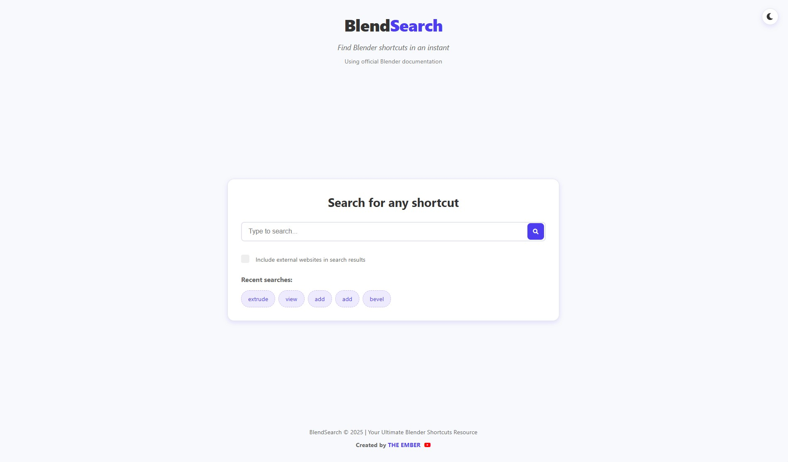
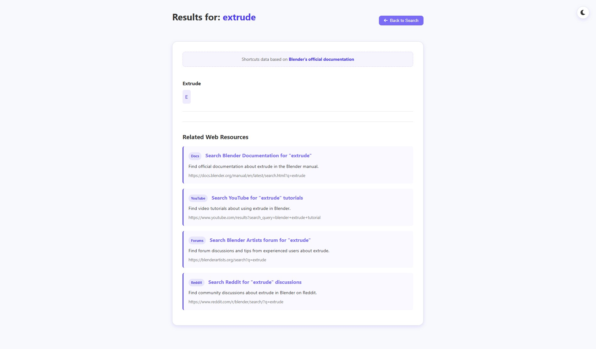
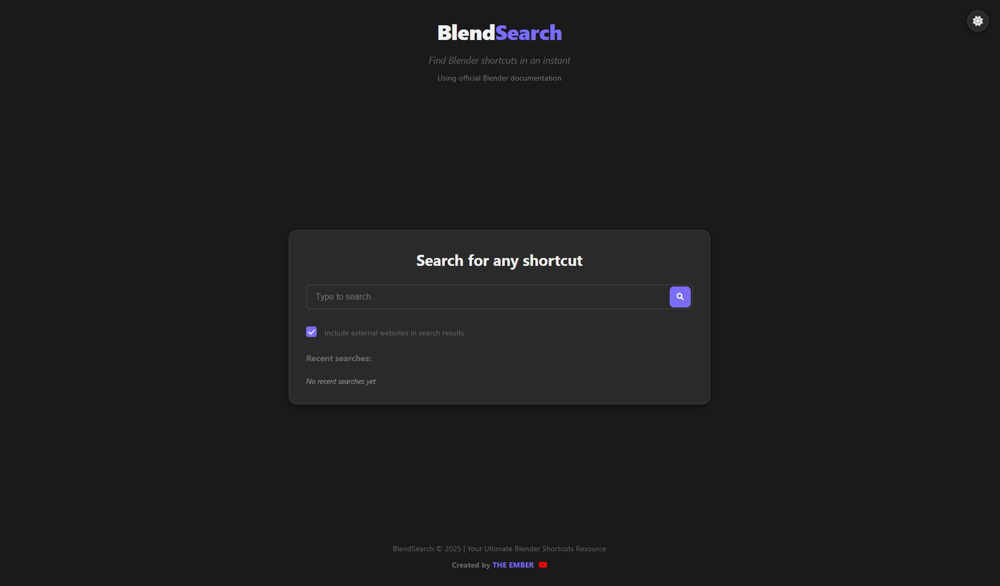

# BlendSearch

BlendSearch is a fast, efficient web application designed to help Blender users quickly find keyboard shortcuts. Can't remember a Blender shortcut? Just search for it!

## Features

- **Instant Search**: Find Blender shortcuts as you type
- **Recent Searches**: Keep track of your previously searched shortcuts
- **Website Results**: Option to include relevant web resources in search results
- **Responsive Design**: Works on desktop and mobile devices
- **Dark Mode**: Toggle between light and dark themes (can't live without dark mode 😉!)
- **Multiple Data Sources**: Falls back to alternative sources if primary data is unavailable

## How to Use

1. Simply open the `index.html` file in your web browser
2. Type what you're looking for in the search box 
3. Press Enter or click the search button
4. Browse through the matching shortcuts
5. Click "Back to Search" to start a new search
6. Toggle dark mode using the moon/sun icon in the top right corner

## Data Sources

BlendSearch uses multiple data sources to find shortcuts:
1. Official Blender documentation (primary source)
2. Community-compiled resources (fallback source)

The application will clearly indicate when it's using fallback data sources that may be less accurate.

## Technology

BlendSearch is built with:

- HTML5
- CSS3
- Vanilla JavaScript (no frameworks required)
- Data sourced from official Blender documentation

## Development

Want to contribute to BlendSearch?

1. Clone this repository
2. Make your changes
3. Test locally by opening `index.html` in a browser
4. Submit a pull request

### Project Structure

- `index.html` - Main search page
- `results.html` - Search results display
- `styles.css` - Styling for both pages
- `script.js` - JavaScript for the main search page
- `results.js` - JavaScript for the results page
- `blendershortcuts.json` - Primary shortcuts data source
- `blendershortcuts.txt` - Fallback shortcuts data source

## License

BlendSearch is open-source software

---

Created by [THE EMBER](https://youtube.com/@The_Ember) | Your Ultimate Blender Shortcuts Resource
